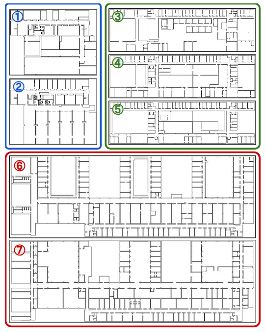

# Competition Updates & Announcements

> **Notice:** Please check this README page regularly for the most up-to-date competition information.

## August 30

**Submission process (Stage 2, final round):** submit your final entry via
this [Google
Form](https://docs.google.com/forms/d/e/1FAIpQLSchbVcmcmURQoiDizhezx1_NO2fYNtW0sqMpkQ5Tgspc_zZww/viewform?usp=header)
by **September 5, Anywhere on Earth (AoE)**. It will ask for:
- Team name
- Submitter's name and email (used for all correspondence)
- Names of the other team members
- Agreement to our [Submission Terms](SUBMISSION_TERMS.md)
- A zip file (max **1GB**) containing `policy.py`, any other files it
  needs to run (additional scripts, model checkpoints, etc.), and a
  README describing your method

**Note:** Stage 2 scoring uses a different, held-out set of floorplans
from the `env1`–`env7` maps released for Stage 1 (see Stages below).

**Note:** Even if you submitted to Stage 1, you should resubmit an updated policy for Stage 2. Stage 2 is the real competition round. If you don't resubmit, your Stage 1 submission will be scored by default.

If you run into a problem submitting via the form (broken link, file size
limit, etc.), send the same information by email to
`seungch2@andrew.cmu.edu`, cc `bradymoon@byu.edu`.

## August 26

Stage 1 (preliminary) results are in! As a reminder, Stage 1 is
feedback-oriented and not the scored round — Stage 2 (see Stages below) is
what counts toward final prizes. Individual feedback will be sent to each participant's email soon.

Scores are average base-station coverage across all 7 released maps
(env1–env7), each run from 4 different starting positions; multi-agent
scores are additionally averaged across team sizes 2–5. A breakdown by map
size (small/medium/large) is available [here](STAGE1_RESULTS.md).

### Single-agent track

| Rank | Team | Score |
|---|---|---|
| 1 | OpenSpaceLab | 61.04% |
| 2 | HeRoLab | 60.12% |
| 3 | TAMU-UADY-Robotics | 55.89% |
| 4 | DZT328 | 32.45% |
| 5 | HORIZON | 25.69% |

### Multi-agent track

| Rank | Team | Score |
|---|---|---|
| 1 | HeRoLab | 63.97% |
| 2 | TAMU-UADY-Robotics | 59.11% |
| 3 | FAIR-KAIST | 55.22% |
| 4 | DZT328 | 49.15% |
| 5 | HORIZON | 47.24% |

## August 16

We're releasing ground-truth floorplan data that you're free to use
however you'd like for this multi-robot (and single-robot) exploration and
relaying problem — for example, but not limited to, training a map
prediction model, or training a learned navigation policy over a training
set of indoor floorplans. All of the following are optional:

- **Training data:** ground-truth floorplan / observed-area pairs (the
  observed area collected via the nearest-frontier method) — useful if
  you'd like to train your own map-prediction model:
  [link](https://drive.google.com/file/d/1S_8z-T3B9lISqr5tPcE7klTP0tRHifPR/view) 
- **Pretrained weights:** if you'd rather not train your own, you're
  welcome to use [MapEx](https://github.com/castacks/MapEx)'s pretrained
  LaMa weights directly:
  [link](https://drive.google.com/drive/u/0/folders/1u9WZ9ftwaMbP-RVySuNSVEdUDV_x4Dw6)

## August 9

1. **Submission process (Stage 1):** if you're entering the preliminary
   round, submit via this [Google
   Form](https://docs.google.com/forms/d/e/1FAIpQLSes1TAmSbyK-_Mf67V3xbOMDzQ8rFsn03Co6WadGIAfVyfGTA/viewform?usp=publish-editor)
   (one submitter per team) by **August 22** — extended a week from the
   original deadline so you can attend the two Friday office hours. It will ask for:
   - Team name
   - Submitter's name and email (used for all correspondence)
   - Names of the other team members
   - A zip file (max **1GB**) containing `policy.py`, any other files it
     needs to run (additional scripts, model checkpoints, etc.), and a
     README describing your submission

   **Note:** this is a different form from the one on the workshop website
   used for registration — please use the link above for your submission.
   We'll update the website to point to this same link shortly.

   If you run into a problem submitting via the form (broken link, file
   size limit, etc.), send the same information by email to
   `seungch2@andrew.cmu.edu`, cc `bradymoon@byu.edu`.

2. **(Stage 2) Final Submission** deadline will be **September 5**.

3. **Timing rule:** we measured the baseline average wall-clock time per
   timestep on our own evaluation machine — an NVIDIA GeForce RTX 4090
   (24GB) paired with an Intel Core i9-13900K (24 cores / 32 threads) —
   running the provided baseline policy:

   | Environment | `num_robots` | Total time/step | Per-robot time/step |
   |---|---|---|---|
   | env1 (small) | 1 | 0.025s | 0.025s |
   | env3 (medium) | 1 | 0.032s | 0.032s |
   | env3 (medium) | 3 | 0.095s | 0.032s |
   | env3 (medium) | 5 | 0.170s | 0.034s |
   | env7 (large) | 5 | 0.220s | 0.044s |

   Per-robot cost stays fairly stable (~0.025–0.044s) regardless of
   environment size or team size, so the budget is set **per robot per
   timestep** rather than as a single flat number: your submission's time
   budget for a run is `num_robots × 0.5` seconds per timestep. That's
   roughly **10x** our slowest observed per-robot baseline (env7's
   0.044s/robot) — a deliberately generous buffer meant to comfortably
   fit real model inference, not to penalize legitimate learned policies.
   Runs whose average exceeds this budget will be stopped early at that
   point — whatever coverage you've achieved so far still counts, so a
   slower policy simply gets less time to explore rather than being
   penalized through a separate formula.

## August 8

### Competition Prizes

Prizes are awarded separately per track (you can enter either or both):

**Single-agent**
* **1st Place:** Certificate + $500 USD
* **2nd Place:** Certificate + $150 USD
* **3rd Place:** Certificate

**Multi-agent**
* **1st Place:** Certificate + $1,000 USD
* **2nd Place:** Certificate + $350 USD
* **3rd Place:** Certificate

### Weekly Office Hours

Have questions or need help troubleshooting? Join us for weekly office hours throughout the submission period:

* **When:** Every Friday, 10:00 AM – 11:00 AM ET 
* **Zoom:** [[Join Office Hours](https://cmu.zoom.us/j/6816076648?pwd=bNtsItL4mO8MJi4sbvXoZbOvvRtRjx.1)]

If you have any questions regarding the competition, please email `seungch2@andrew.cmu.edu` and cc `bradymoon@byu.edu`.

# Indoor Exploration Competition

Multi-robot (and single-robot) indoor exploration and relaying under
communication constraints. Robots explore an unknown environment using only
local sensing and limited peer-to-peer communication, and must get what
they've learned back to a fixed base station. **What you write is the
policy** — exploration strategy, and optionally relay strategy too.
Everything else (sensing, motion, communication, the environment) is
provided and identical for every submission.

## Tracks

Submissions are scored on two tracks:

- **Single-agent** — `num_robots: 1`
- **Multi-agent** — `num_robots: 2, 3, 4, 5`

You write one `Policy`; it's evaluated across both. Official scoring also
runs across environments grouped by size, each with its own timestep
budget (`max_steps`) — single-agent gets a larger budget than multi-agent
on the same environment:

| Size | Released examples | Single-agent `max_steps` | Multi-agent `max_steps` |
|---|---|---|---|
| Small | `env1`, `env2` | 1000 | 500 |
| Medium | `env3`, `env4`, `env5` | 1500 | 1000 |
| Large | `env6`, `env7` | 2000 | 1500 |

(See Stages below — Stage 2's held-out maps aren't `env1`–`env7`
themselves, but follow this same size-based `max_steps` scheme.)

## Stages

- **Stage 1 (preliminary, optional)** — submit your policy to us and we'll
  run it on the released test environments (`env1`–`env7`), score it, and
  post results to a leaderboard along with feedback.
- **Stage 2 (final)** — the actual scored round. You don't need to have
  submitted to Stage 1 to enter Stage 2, but Stage 2 submissions get no
  feedback. Scoring runs on a different, held-out set of environments (not
  `env1`–`env7`), sized and budgeted per the table above.

## Environment setup

```bash
conda env create -f environment.yml
conda activate iig
```

After installing and activating `iig` environment, build from source to install `range_libc`. 

```
cd range_libc/pywrapper

# Install build dependencies (if needed)
conda install -y cython

# Build and install
python3 setup.py install

# Verify installation
cd ../..
python3 -c "import range_libc; print('range_libc installed successfully')"
```

## Quick start

Before running, set `root_path` in `configs/multi-robot.yaml` to your local
clone's path.

From the `scripts/` directory:

```bash
cd scripts
python3 main.py
```

This runs the simulation defined by `configs/multi-robot.yaml` using the
baseline `NearestFrontierPolicy`. To run your own policy instead:

```bash
python3 main.py --policy_path /path/to/your_policy.py
```

## What's provided (do not modify)

These implement the simulation itself and are the same for every
participant:

| File | What it does |
|---|---|
| `scripts/environment.py` | The `World`: environment/map representation and the main per-timestep loop |
| `scripts/robot.py` | Robot state, raycast-based sensing, motion execution |
| `scripts/comm.py` | The communication model (range, walls, signal attenuation) and info-sharing between robots/base station |
| `scripts/base_station.py` | The base station |
| `scripts/policy.py` (`PlanningEngine`) | Turns your policy's decisions into actual simulation effects: executing movement under the fixed per-step speed cap, pathing to base while relaying, and applying the bookkeeping (mask transfer, mode switches) once a relay hand-off is decided |
| `scripts/main.py` | Simulation entry point and CLI |
| `scripts/visualizer.py` | Per-timestep visualization |
| `scripts/scoring.py` | Scoring metric |

## What you implement

You write a `Policy` class with up to three decisions, all made per-robot:

- **`decide()`** (required) — where to explore next.
- **`should_relay()`** (optional) — when to switch from exploring to relaying info back to base.
- **`decide_relay_handoff()`** (optional) — while relaying, whether to hand relay duty off to a nearer connected robot, and to whom.

If you don't override `should_relay()`/`decide_relay_handoff()`, you get the
provided baseline behavior for free, matching the shipped config
(`configs/multi-robot.yaml`):

- **Periodic relaying**: every `relay_period` steps (default 200), switch
  from exploring to walking back to base to report. `'periodic'` is
  currently the only implemented trigger mode for the default
  `should_relay()` — override it yourself if you want a different trigger
  (e.g. information-gain-based).
- **End-of-run safety net** (`final_relay`, on by default): regardless of
  the periodic schedule, once too little time is left in the run to walk
  back to base, force a final return — so a robot never strands unreported
  data when `max_steps` runs out.
- **Handoff** (`relay_transfer`, on by default): while relaying, hand off to
  the nearest currently-connected robot that's closer to base than you,
  instead of always walking back yourself.

Override `should_relay()` and/or `decide_relay_handoff()` to compete on
relay strategy as well as exploration.

1. Copy `scripts/policies/nearest_frontier.py` as a starting point, or start from scratch.
2. Subclass `BasePolicy` (`scripts/base_policy.py`) and implement `decide()`
   (and optionally `should_relay()`/`decide_relay_handoff()`):

   ```python
   from base_policy import BasePolicy

   class Policy(BasePolicy):
       def decide(self, obs, collect_opts):
           # obs: your robot's own sanitized view of the world (see below)
           # return: a (row, col) goal position to explore toward
           ...

       # optional — omit to use the provided periodic/final-only default
       def should_relay(self, obs, collect_opts, t, max_steps):
           # return 'relay', 'final_relay', or None to keep exploring
           ...

       # optional — omit to use the provided nearest-closer-robot default
       def decide_relay_handoff(self, obs, collect_opts):
           # return a robot id from obs.connected_robot_ids to hand off to, or None
           ...
   ```

3. Run it with `python3 main.py --policy_path your_policy.py`. Your file must
   define a class named exactly `Policy`.

`decide()` is only called while a robot is in `explore` mode, and only when
it needs a new goal (i.e. its current goal was reached or is no longer
valid) — not every single timestep. `should_relay()` is checked every
timestep while exploring. `decide_relay_handoff()` is checked every timestep
while relaying (only if `relay_transfer` is enabled in the config).

### What `obs` (the `Observation`) contains

Only what your robot has legitimately sensed or received over
communication — never ground truth:

- `obs.combined_obs_map` — your robot's map so far (unknown / free / occupied). Whenever two robots (or a robot and the base station) are in comm range, their maps are automatically fused, so this can include cells a peer observed, not just what your own sensor has seen. Fusion is provided/automatic — identical for every submission — not something `decide()` controls.
- `obs.pose` — your robot's current position
- `obs.unreported_mask`, `obs.delegated_mask` — bookkeeping on what's been observed but not yet reported to base
- `obs.pose_lists_of_others`, `obs.intents_of_others` — other robots' trajectories/intents, as last shared over comm (may be stale if out of range)
- `obs.base_pose` — the base station's position (always known)
- `obs.connected_robot_ids` — robot ids currently (this timestep) in comm range, so entries for them in `pose_lists_of_others` are guaranteed fresh, not stale — useful for `decide_relay_handoff()`

### Your goal doesn't have to be frontier-based

Any exploration strategy is allowed (frontier-based, sampling-based,
potential-field, learned, etc.) as long as it only uses `obs`. Returning
`None` from `decide()` is a legitimate way to say "no opinion" - the
framework falls back to the nearest reachable frontier in that case. But if
you return a specific goal, it has to actually be reachable: an
unreachable, occupied, out-of-bounds, or malformed goal raises
`InvalidGoalError` and halts the run immediately, rather than being
silently patched up for you.

### Provided utility toolkit (`scripts/policy_utils.py`)

Optional helpers you can use inside `decide()`, or ignore entirely:

- `get_frontiers(obs_map)` — candidate frontier points between known-free and unknown space
- `crowding_avoidance_penalty(...)` — penalize candidates near other robots' known trajectories/intents, to reduce redundant coverage
- `inflate_map(occ_map)` — an inflated/cost-biased map, useful if you want to reason about path cost yourself
- `estimate_time_for_path(path)` — estimate how many timesteps a path will take
- `default_should_relay(...)` / `default_relay_handoff(...)` — the provided relay-strategy baselines themselves; call these from your own `should_relay()`/`decide_relay_handoff()` if you want to build on top of the default instead of replacing it entirely

## Config file (`configs/multi-robot.yaml`)

Most fields can also be overridden from the command line — run
`python3 main.py --help` for the full list. Fields fall into a few groups:

**Fixed — identical for every submission.** These define the sensing/
communication model itself. Changing them changes the actual challenge, not
just your strategy, so they should stay at the shipped values for a fair
comparison:
- Sensing: `lidar_range`, `num_laser`, `pixel_per_meter`
- Communication model: `comm_range`, `attenuation_constant`,
  `transmitted_power`, `path_loss_exponent`, `power_threshold`
- `pd_size` — padding (in pixels) added around every map internally (see
  `World.get_kth_occ_validspace_map` in `environment.py`), cropped back out
  before scoring and display. This isn't just cosmetic — `scoring.py` crops
  by this exact amount, so it must match the padding `environment.py`
  actually applies; it's also handed to your policy as `obs.pd_size`. Not
  something to change.
- `start_pose` — all robots *and* the base station start at this same
  single point (see `main.py`, where the same `start_pose` is passed to
  every `Robot` and to `BaseStation`). The shipped value is only a
  placeholder for local runs; official scoring will use a start position
  that isn't disclosed in advance. We'd encourage trying a variety of
  start poses locally (not just the shipped one) so your policy isn't
  implicitly tuned to one specific starting layout.

  All range/distance fields above (`lidar_range`, `comm_range`, and the
  crowding-avoidance thresholds below) are in **meters**, converted
  internally via `pixel_per_meter` — not pixels. Keep that in mind if your
  `decide()` reasons about distances directly in `obs.pose`/map coordinates.

**Evaluation axes — varied by us across a known set for official scoring;
feel free to experiment with other values locally too.** Unlike the fixed
group above, these aren't pinned to one value — your submission is scored
across a range of conditions, so it should generalize rather than assume
one setting:
- `num_robots` — official scoring covers both tracks (see Tracks above:
  1 robot, and 2/3/4/5 robots); tune it locally to whatever you like while
  developing
- `environment` — official scoring runs across multiple maps, not just one
  (Stage 1: `env1`–`env7`; Stage 2: a different held-out set — see Stages
  below). `env1`–`env7` are available under `test_maps/` (default `env3`)
  for you to test against locally:

  
- `max_steps` — official scoring uses the track/environment-size-dependent
  budgets in the Tracks table above, not the shipped default; tune it
  locally to whatever you like while developing

**Strategy parameters — yours to tune.** These only shape the *default*
behaviors and optional utilities available to your policy; change them
freely, or ignore them entirely by overriding the corresponding method:
- `other_traj_threshold`, `other_intent_threshold` — crowding-avoidance
  distances used by the optional `crowding_avoidance_penalty()` helper;
  irrelevant if you don't call it
- `relay_period`, `relay_trigger` — parameters of the *default*
  `should_relay()` (only `'periodic'` is implemented for `relay_trigger`
  today; override `should_relay()` yourself for a different trigger)
- `final_relay` — whether the default `should_relay()`'s end-of-run safety
  trigger (force a return to base once too little time remains) is active
- `relay_transfer` — whether `decide_relay_handoff()` is called at all.
  Since `decide_relay_handoff()` is already optional, you can get the same
  "never hand off" effect by overriding it to always return `None`, so this
  is just a convenience switch on the same axis as the other relay fields.

**Visualization-only (no effect on scoring):**
- `save_viz` — save a plot every `viz_freq` timesteps: each robot's own
  view (its `combined_obs_map` and trajectory, plus its communication
  range if `viz_comm` is on), and a base-station panel. Each robot's panel
  also overlays the other robots' trajectories and intents as last shared
  over comm (so both can be stale rather than live).
- `viz_gt_map` — if `True`, shows the ground-truth map with the observed
  area overlaid; if `False`, shows only `combined_obs_map` — i.e. what the
  robot itself currently knows
- `viz_comm` — overlay each robot's current communication range
- `viz_video` — additionally render an aggregated video summary of the
  whole run (separate from the per-timestep plots above)

## Scoring

At the end of a run, `main.py` prints the final **base-station coverage**:
the fraction of the true map the base station has learned about by
`max_steps`. This rewards actually getting information home, not just
observing it — so both exploration and relay strategy matter for score.

## Map prediction (coming soon)

We'll be releasing training data of floorplans that can be used for map
prediction — e.g. inferring the likely layout of still-unknown areas from
what's been observed so far, to inform exploration. Not available yet;
we'll announce here once it's released. In the meantime, for a sample
prediction approach, see [MapEx](https://github.com/castacks/MapEx)
(`github.com/castacks/MapEx`).
